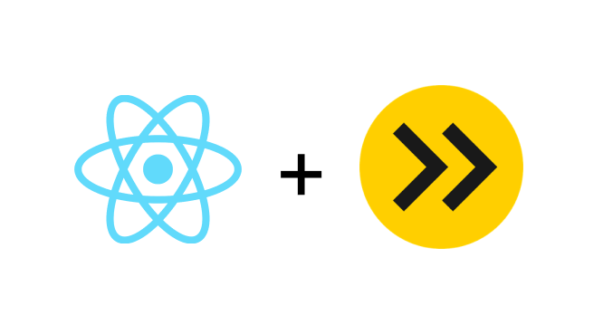
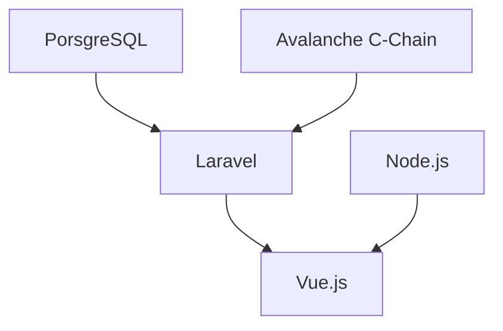

<a name="readme-top"></a>

<!-- PROJECT SHIELDS -->

[![Contributors][contributors-shield]][contributors-url]
[![Forks][forks-shield]][forks-url]
[![Stargazers][stars-shield]][stars-url]
[![Issues][issues-shield]][issues-url]
[![MIT License][license-shield]][license-url]

<!-- PROJECT LOGO -->
<br />
<div align="center">
  <a href="/">
    
  </a>

  <h3 align="center">React-Esbuild Template</h3>

  <p align="center">
    An opionionated React Template that is built for customization!
    <br />
    <a href="https://github.com/data-miner00/React-Esbuild-Template"><strong>Explore the docs »</strong></a>
    <br />
    <br />
    <a href="https://github.com/data-miner00/React-Esbuild-Template">View Demo</a>
    ·
    <a href="https://github.com/data-miner00/React-Esbuild-Template/issues">Report Bug</a>
    ·
    <a href="https://github.com/data-miner00/React-Esbuild-Template/issues">Request Feature</a>
  </p>
</div>

<!-- TABLE OF CONTENTS -->
<details>
  <summary>Table of Contents</summary>
  <ol>
    <li>
      <a href="#about-the-project">About The Project</a>
      <ul>
        <li><a href="#built-with">Built With</a></li>
        <li><a href="#design">Design</a></li>
      </ul>
    </li>
    <li>
      <a href="#getting-started">Getting Started</a>
      <ul>
        <li><a href="#prerequisites">Prerequisites</a></li>
        <li><a href="#installation">Installation</a></li>
      </ul>
    </li>
    <li><a href="#usage">Usage</a></li>
    <li><a href="#roadmap">Roadmap</a></li>
    <li><a href="#contributing">Contributing</a></li>
    <li><a href="#license">License</a></li>
    <li><a href="#acknowledgments">Acknowledgments</a></li>
  </ol>
</details>

<!-- ABOUT THE PROJECT -->

## About The Project


An extremely opinionated template for building React applications. Focus on the application itself rather than all these low-level configuration stuffs.

Incentives:

- Wanted to build a web portal with Zilliqa.js
- Don't want to use `create-react-app`
- Don't want to use Next.js
- Buitl this React template so I can use for other projects.

Of course, no one template will serve all projects since your needs may be different. So I'll be adding more in the near future. You may also suggest changes by forking this repo and creating a pull request or opening an issue. Thanks to all the people have contributed to expanding this template!

<p align="right">(<a href="#readme-top">back to top</a>)</p>

### Built With

The technologies and tools used within this template.

- React
- Esbuild
- ESLint
- TypeScript
- Jest/Testing Library
- TailwindCSS
- Framer Motion
- GitHub Workflow
- i18next
- Prettier
- Zod
- react-icons

<p align="right">(<a href="#readme-top">back to top</a>)</p>

<!-- DESIGN -->

### Design

Charts are very useful to let people know the high level designs of the project. Usually people will use some of more sophisticated third-party diagramming tools such as Enterprese Architect or a light-weighted [draw.io](https://app.diagrams.net).

Contrary to the public's awareness, GitHub actually supports diagramming language [Mermaid](https://docs.github.com/en/get-started/writing-on-github/working-with-advanced-formatting/creating-diagrams#creating-mermaid-diagrams) that can generate a wide array of diagrams such as flowchart, sequence diagram, class diagram and more!



<p align="right">(<a href="#readme-top">back to top</a>)</p>

<!-- GETTING STARTED -->

## Getting Started

### Prerequisites

The list of tools that is used when development.

- npm
  ```sh
  npm install npm@latest -g
  ```
- Pnpm
  ```sh
  npm i -g pnpm
  ```
- [Git](https://git-scm.com/downloads)

### Installation

_To use this template for personal use or contribution, simply perform the following._ A total of **3 terminals** are required to get 3 of the core components of application up and running for development. However, it is possible to start all the necessary processes with one terminal by using `pnpm dev` as shown on step 7.

1. Clone the repo
   ```sh
   git clone https://github.com/data-miner00/React-Esbuild-Template.git
   ```
2. Install Node dependencies
   ```sh
   pnpm i
   ```
3. Optionally update the dependencies
   ```sh
   pnpm up --latest
   ```
4. Recommend to run tests to check if things are breaking
   ```sh
   pnpm test
   ```
5. Optionally run lint to check if code styles are breaking
   ```sh
   pnpm lint
   ```
6. Run formatter to format code
   ```sh
   pnpm format
   ```
7. Start Esbuild, Tailwind JIT and local dev server concurrently. Skip 8,9,10
   ```sh
   pnpm dev
   ```
8. Start Esbuild (requires 1 terminal)
   ```sh
   pnpm watch
   ```
9. Start Tailwind JIT (requires 1 terminal)
   ```sh
   pnpm watch:tw
   ```
10. Finally start local dev server (requires 1 terminal)
    ```sh
    pnpm start
    ```
11. Compile for production
    ```sh
    pnpm build:tw
    pnpm build
    ```
12. Purge dist folder
    ```sh
    pnpm purge
    ```

<p align="right">(<a href="#readme-top">back to top</a>)</p>

<!-- ROADMAP -->

## Roadmap

- [x] Add TypeScript
- [x] Add ESLint
- [x] Add Jest/Testing Library
- [x] Add React Router (Lazy Loading)
- [x] Add 404 page
- [x] Add Framer Motion
- [x] Add Styling
  - [ ] Sass
  - [x] Tailwind
- [x] Add i18n
  - [ ] Korean
  - [x] Japanese
  - [ ] Chinese
- [ ] Authentication
  - [ ] OAuth 2.0? OpenID Connect?
- ~[ ] Prisma~
- [x] Dark mode
- [x] Add GitHub workflows
- [ ] Add PWA Manifest
- [ ] Mobile Responsive
  - [ ] Navbar and header
- [ ] Add E2E tests

See the [open issues](https://github.com/data-miner00/React-Esbuild-Template/issues) for a full list of proposed features (and known issues).

<p align="right">(<a href="#readme-top">back to top</a>)</p>

<!-- CONTRIBUTING -->

## Contributing

Contributions are what make the open source community such an amazing place to learn, inspire, and create. Any contributions you make are **greatly appreciated**.

If you have a suggestion that would make this better, please fork the repo and create a pull request. You can also simply open an issue with the tag "enhancement".
Don't forget to give the project a star! Thanks again!

1. Fork the Project
2. Create your Feature Branch (`git checkout -b feature/AmazingFeature`)
3. Commit your Changes (`git commit -m 'Add some AmazingFeature'`)
4. Push to the Branch (`git push origin feature/AmazingFeature`)
5. Open a Pull Request

<p align="right">(<a href="#readme-top">back to top</a>)</p>

<!-- LICENSE -->

## License

Distributed under the MIT License. See `LICENSE` for more information.

<p align="right">(<a href="#readme-top">back to top</a>)</p>

<!-- ACKNOWLEDGMENTS -->

## Acknowledgments

List of resources that are helpful and would like to give credit to.

- [Why You Should Use ESBuild OVER Webpack for React Projects](https://www.youtube.com/watch?v=VmgRBwMIRBE)
- [esbuild homepage](https://esbuild.github.io/)
- [SyntaxError: Support for the experimental syntax jsx isn’t currently enabled](https://akashmittal.com/code-example-syntaxerror-support-for-the-experimental-syntax-jsx-isnt-currently-enabled/)
- [Robots.txt](https://developers.google.com/search/docs/crawling-indexing/robots/intro)
- [useHooks](https://usehooks.com/)
- [Configuring Public Path](https://esbuild.github.io/api/#public-path)
- [eslint-config-prettier](https://github.com/prettier/eslint-config-prettier#installation)
- [Issue Template](https://github.com/Josee9988/project-template)
- [[Feature] read substitution variables from .env file](https://github.com/evanw/esbuild/issues/69#issuecomment-1324478979)
- [ESLint Typescript](https://typescript-eslint.io/)
- [GitHub Actions](https://github.com/marketplace?type=actions)
- [Pnpm CI](https://pnpm.io/continuous-integration)
- [global is not defined](https://github.com/WalletConnect/walletconnect-monorepo/issues/1144)

<p align="right">(<a href="#readme-top">back to top</a>)</p>

<!-- MARKDOWN LINKS & IMAGES -->

[contributors-shield]: https://img.shields.io/github/contributors/data-miner00/React-Esbuild-Template.svg?style=for-the-badge
[contributors-url]: https://github.com/data-miner00/React-Esbuild-Template/graphs/contributors
[forks-shield]: https://img.shields.io/github/forks/data-miner00/React-Esbuild-Template.svg?style=for-the-badge
[forks-url]: https://github.com/data-miner00/React-Esbuild-Template/network/members
[stars-shield]: https://img.shields.io/github/stars/data-miner00/React-Esbuild-Template.svg?style=for-the-badge
[stars-url]: https://github.com/data-miner00/React-Esbuild-Template/stargazers
[issues-shield]: https://img.shields.io/github/issues/data-miner00/React-Esbuild-Template.svg?style=for-the-badge
[issues-url]: https://github.com/data-miner00/React-Esbuild-Template/issues
[license-shield]: https://img.shields.io/github/license/data-miner00/React-Esbuild-Template.svg?style=for-the-badge
[license-url]: https://github.com/data-miner00/React-Esbuild-Template/blob/master/LICENSE.txt
[product-screenshot]: images/screenshot.png
[react.js]: https://img.shields.io/badge/React-20232A?style=for-the-badge&logo=react&logoColor=61DAFB
[react-url]: https://reactjs.org/
